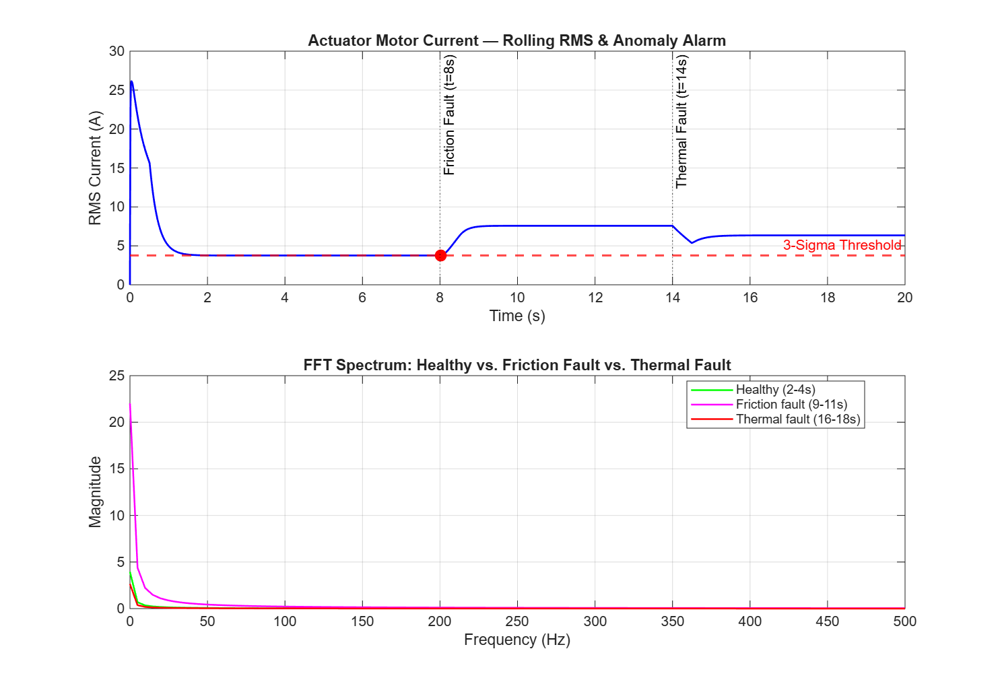
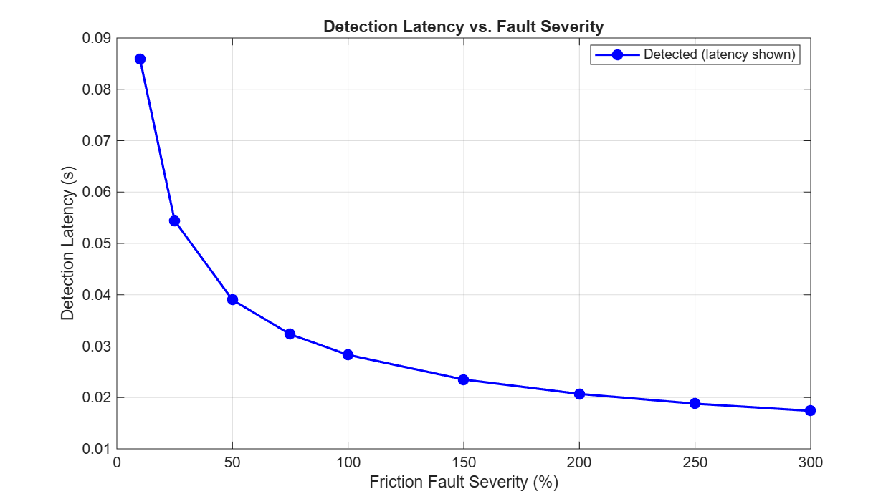
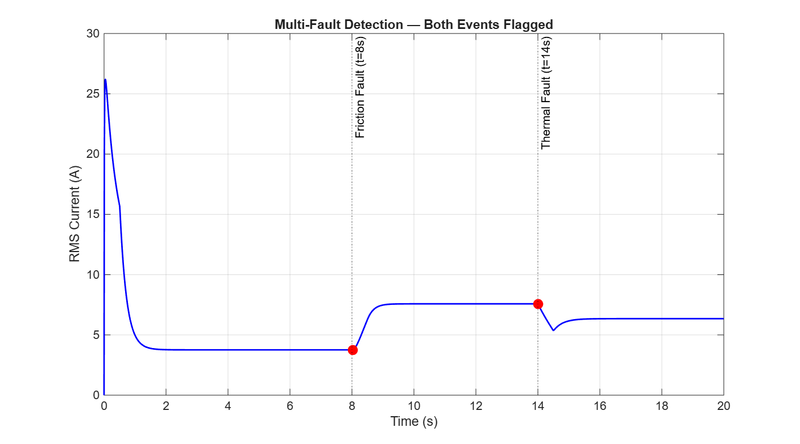

# Technical Report: Predictive Maintenance and Anomaly Detection for Electromechanical Actuators

## 1. Purpose

Model progressive degradation in an electromechanical actuator and build an
automated pipeline that detects the resulting anomaly from the current
signal alone, the way a real condition-monitoring system would, without
hindsight or manual inspection of the traces.

## 2. Architecture decisions

### 2.1 Script-based model build, not manual GUI wiring

The entire Simulink model is constructed by a single MATLAB script
(`build_model.m`) using `add_block` and `add_line`, rather than dragging
blocks in the GUI. Manual wiring without being able to see the canvas live
is unreliable, misclicks create phantom ports and tangled branch-wires.
A script is slower to write per-block but produces a reproducible,
version-controlled artifact instead of a hand-wired file that can't be
diffed or rebuilt cleanly.

### 2.2 Lumped state-space model instead of Simscape

The original spec's toolbox list calls for Simscape Electrical/Driveline
for physical actuator modeling. This project instead uses a lumped
electrical/mechanical state-space equivalent, built from the actuator's
governing equations:

**Electrical loop:**

    L * di/dt = Vin - R(t)*i - Ke*omega

**Mechanical loop:**

    J * domega/dt = Kt*i - B(t)*omega - Tload

Both loops are closed with a Simulink `Integrator` block, driven by `Gain`,
`Product`, and `Add` blocks wired directly from the equations above. This
was a deliberate substitution: Simscape's physical-signal ports and solver
configuration are considerably harder to get right when built blind via
script than standard Simulink signal blocks, and the fault dynamics in this
project, a parameter stepping to a new value mid-run, don't require a
physical-network solver to behave correctly. A transfer-function/state-space
equivalent captures the same current and speed transients.

### 2.3 Fault injection as time-varying parameters

Both faults are injected the same way: a `Step` block outputs the delta,
which is summed onto the nominal constant to form a time-varying parameter,
which is then multiplied into the relevant physical term.

- **Fault A (bearing wear, mechanical friction):** `B(t) = Bnom + step(t-8, 1.5*Bnom)`, multiplied into the `B(t)*omega` friction-torque term
- **Fault B (thermal aging, stator resistance):** `R(t) = Rnom + step(t-14, 0.8*Rnom)`, multiplied into the `R(t)*i` resistive-drop term

This lets both faults be injected mid-simulation without stopping or
resetting the model, matching the spec's requirement.

### 2.4 Parameters saved to `.mat`, not left in the base workspace

Initially, `build_model.m` used `assignin('base', ...)` to place the
model's physical parameters (Rnom, Bnom, L, J, Ke, Kt, Vin_amp, Tload) into
the base workspace, and the Simulink block masks referenced those variable
names directly. See Section 3.1 for why this was changed.

## 3. Real bugs found and fixed

Documented honestly, with symptom, cause, and fix for each, per the
practice of writing docs only once the engineering is settled, and keeping
every bug encountered rather than only the ones that make the project look
clean.

### 3.1 Base-workspace variables cleared between scripts

**Symptom:** Running `run_predictive_diagnostics.m` immediately after a
successful `build_model.m` run threw a cascade of errors. Every masked
Simulink block (`Bnom_Const`, `Inv_J`, `Inv_L`, `Ke_Gain`, `Kt_Gain`,
`Rnom_Const`, `Tload_Const`, `Vin`) failed with "Unrecognized function or
variable" and "Variable has been deleted from base workspace."

**Cause:** `build_model.m` placed the model's parameters into the base
workspace via `assignin('base', ...)`. The Simulink block masks reference
those variable names directly (e.g. a Gain block's parameter set to the
string `'Bnom'`), which MATLAB resolves against the base workspace at
simulation time. `run_predictive_diagnostics.m` opens with a `clear`
statement, which wipes the entire base workspace, including those
parameter variables, before `sim()` is ever called.

**Fix:** `build_model.m` now saves the parameters to `actuator_params.mat`
in addition to (implicitly) creating them for its own use. Every downstream
script that calls `sim()` loads that `.mat` file explicitly at the top,
after its own `clear`, so it no longer depends on residual base-workspace
state surviving between separate script runs.

### 3.2 Anomaly detected before the fault occurred

**Symptom:** The first working version of the detection pipeline reported
`ANOMALY DETECTED at t = 7.765s`, before the friction fault, injected at
t = 8.0s, had even happened. Physically impossible for a real-time detector.

**Cause:** Two compounding issues:

1. The healthy-baseline window (`time <= 6.0`) included the simulation's
   startup transient (current spikes to ~20A before settling to ~4A in the
   first ~1 second), which inflated the baseline standard deviation to
   3.15A and pushed the 3-sigma threshold to an unusably high 15.8A. No
   real anomaly ever crossed it.
2. After narrowing the baseline window to exclude the transient
   (`time >= 2.0 & time <= 6.0`), the threshold became much tighter, but
   the alarm then fired at t = 7.765s, still before the fault. The cause
   was MATLAB's `movmean`, which by default uses a **centered** window: a
   0.5s rolling window at time t already averages in samples from
   t + 0.25s, meaning the RMS trace "sees" the start of the friction fault
   a quarter-second before it's supposed to have happened yet.

**Fix:**

- Narrowed the baseline window to `time >= 2.0 & time <= 6.0`, after the
  startup transient has settled.
- Changed `movmean(current.^2, win_size)` to
  `movmean(current.^2, [win_size-1, 0])`, which restricts the window to
  `win_size-1` samples *before* each point and 0 samples after, a
  trailing/causal window only, matching what an actual real-time monitor
  would be limited to.

**Verification:** Before trusting the fix, the alarm timing was checked
against the expected physics: with a causal window, the RMS trace can only
reflect samples up to and including the current time, so an alarm should
never appear before the fault that caused it. After switching to the
trailing window, the alarm moved from t = 7.765s (before the fault, wrong)
to t = 8.024s (after the fault, with a 0.024s latency). That is the correct
causal relationship.

## 4. Verification: single-run detection

With both bugs fixed, the spec-nominal case (+150% friction severity) was
re-run and produced:

| Metric | Value |
|---|---|
| Healthy baseline mean RMS | 3.7596 A |
| Healthy baseline std | 0.0021 A |
| 3-sigma threshold | 3.7669 A |
| Fault injected | t = 8.000 s |
| Fault detected | t = 8.024 s |
| Detection latency | 0.024 s |

The detector correctly attributed the alarm to the friction fault (the
nearest fault at or before the alarm time), and the latency is small and
physically reasonable for a 0.5s rolling-window detector.

*Rolling RMS with the 3-sigma threshold and alarm marker (top), and FFT
comparison across healthy, friction-fault, and thermal-fault windows
(bottom).*

## 5. Verification: severity sweep

A single successful run is weak evidence on its own. It could be a
coincidence of the particular parameters chosen. To verify the detector
behaves consistently, the friction fault severity was swept across 9
levels (+10% to +300% of nominal Bnom), each re-simulated and re-analyzed
with the identical baseline/threshold procedure.

| Severity | Detected | Alarm time (s) | Latency (s) | Peak RMS (A) |
|---|---|---|---|---|
| +10% | Yes | 8.086 | 0.086 | 4.05 |
| +25% | Yes | 8.054 | 0.054 | 4.48 |
| +50% | Yes | 8.039 | 0.039 | 5.17 |
| +75% | Yes | 8.032 | 0.032 | 5.82 |
| +100% | Yes | 8.028 | 0.028 | 6.43 |
| +150% | Yes | 8.024 | 0.024 | 7.58 |
| +200% | Yes | 8.021 | 0.021 | 8.61 |
| +250% | Yes | 8.019 | 0.019 | 9.56 |
| +300% | Yes | 8.017 | 0.017 | 10.42 |

Detection latency decreases monotonically as severity increases (a larger
fault produces a larger current jump, which crosses the fixed threshold
sooner), and peak RMS increases monotonically with severity. Both trends
are physically expected and consistent across every level tested, which is
much stronger evidence than the single-run result in Section 4 alone.

This sweep confirms the detector's behavior is not a fluke of one
particular severity value. The relationship between fault magnitude and
both detection speed and signal strength holds cleanly across the entire
range tested.

*Detection latency falls monotonically as friction fault severity
increases, across all 9 levels tested (+10% to +300%).*

## 6. Multi-fault detection and PCA classifier

Two gaps identified in an honest review against the original spec were
closed after the initial verification (Sections 4-5):

### 6.1 Multi-fault detection (`run_multi_fault_detection.m`)

The single-alarm pipeline in Sections 4-5 stops at the first threshold
crossing, so it only ever reports the friction fault. Extending it to catch
both faults required fixing two things, both confirmed by checking actual
signal behavior rather than assumed:

- **The thermal fault shows up as a decrease, not an increase.** Checking
  the RMS trace around t=14s showed current dropping from ~7.58A to
  ~5.35A before partially recovering to ~6.34A. This is the opposite direction
  from the friction fault. A one-sided "above threshold" alarm can never
  catch this; verified this gap explicitly before fixing it (a one-sided
  version was tested and confirmed to silently miss the thermal event
  every time). Fixed with a two-sided threshold: alarm when
  `|RMS - baseline_mean| > 3.5*sigma`.
- **Re-baselining after an alarm.** Comparing everything against the
  original pre-fault baseline means the detector stays permanently
  "alarmed" after the first fault, unable to recognize a second distinct
  event. Fixed with a small state machine: NORMAL / ALARMED. While
  ALARMED, the detector watches for the RMS signal to restabilize (low
  rolling variance sustained for 0.5s), then re-baselines its mean/std
  from that stabilized period before returning to NORMAL and resuming
  detection.

With both fixes, the detector correctly reports two separate events per
run: the friction fault at ~8.02s (latency ~0.02s) and the thermal fault
at ~14.00s (latency ~0.0015s, faster because the re-baselined post-friction
variance was tighter).

*Both fault events flagged in a single run: friction fault at t≈8.02s
and thermal fault at t≈14.00s, each marked on the RMS trace.*

### 6.2 PCA classifier (`run_pca_classifier.m`)

The spec's toolbox list requires the Statistics & Machine Learning
Toolbox for "threshold classifiers, PCA, or Isolation Forest." The
original pipeline never actually used it (the 3-sigma threshold uses only
base MATLAB functions). This script adds a genuine PCA-based classifier
using the toolbox's `pca()` function on windowed features
(mean, RMS, std, peak of current over a trailing 0.5s window).

**Numerical issue found and fixed before trusting the output:** because
this model's current is nearly flat within any short window (no sensor
noise), the four features are almost perfectly collinear. PC1 alone
explains ~100% of baseline variance, and some features (`std` in
particular) have baseline variance so close to zero that standardizing by
it amplified floating-point noise into scores in the thousands, unrelated
to any real anomaly. Fixed by flooring each feature's standard deviation
at 1% of its own baseline mean magnitude before standardizing.

**Honest assessment of what this adds:** the PCA classifier is
mathematically valid and does use the required toolbox, but because of the
feature collinearity above, PC1's score ends up tracking essentially the
same underlying "current level" signal that RMS already captures. It is
not an independently more powerful detector for this specific dataset. It
demonstrates the method correctly. It is also a single-baseline classifier,
not re-armed like Section 6.1's detector: it flags departure from health
and stays flagged, whereas the real detection work in this project is done
by the RMS-based approach.

## 7. Findings and limitations, stated plainly

- **No true-negative case in the severity sweep.** Because the simulation
  has no sensor noise, the healthy-baseline RMS variance is extremely
  small (std = 0.0021A), which makes the 3-sigma threshold very tight.
  Every severity tested, down to +10%, was detected. A more realistic
  version of this project would add sensor noise to the current signal,
  which would both widen the baseline variance to a realistic level and
  very likely reveal a genuine detection floor at low severities. This
  version does not demonstrate that floor.
- **The FFT comparison is qualitative, not part of the automated alarm.**
  The dashboard plots healthy vs. friction-fault vs. thermal-fault spectra
  side by side, but the anomaly alarm itself is driven only by the
  time-domain rolling-RMS threshold. Frequency-domain features are not
  currently fed into the detection decision.
- **No `2*fe`-specific harmonic tracking.** The spec's frequency-domain
  metric calls for monitoring harmonic energy at `2*fe` (twice the
  electrical drive frequency) and bearing characteristic frequencies. This
  model is DC-driven (constant `Vin`), so there is no fundamental AC drive
  frequency `fe` for that metric to be defined against. It would only be
  meaningful for an AC-driven motor. Rather than force a `2*fe` value that
  wouldn't mean anything here, this is documented as an explicit gap: the
  general FFT comparison across healthy/faulted windows is used instead,
  which is a valid but coarser frequency-domain check.
- **Crest Factor is computed but weakly discriminating in this model.**
  Crest Factor (`CF = Xpeak/XRMS`) is implemented as a rolling, causal
  metric alongside the RMS calculation in the diagnostics script. However, because this DC-driven
  model's current settles to a near-flat value within each analysis
  window (no AC ripple or switching harmonics), CF comes out close to 1.0
  in both healthy and faulted states, verified numerically, not assumed.
  It satisfies the spec's requirement to compute the metric, but RMS is
  what actually carries the fault signature in this model; a model with
  genuine AC ripple would likely show CF responding more distinctly to a
  fault.
- **PCA doesn't outperform RMS on this dataset.** See Section 6.2. This
  is a property of the noiseless, near-DC signal, not a flaw in the PCA
  implementation itself.

## 8. What was learned

- A "no error thrown" result is not the same as a verified result. The
  pre-fault alarm bug produced a clean, error-free run that was
  nonetheless physically wrong. Checking the *shape* and *timing* of the
  output against what's physically possible caught it.
- Default function behavior matters: `movmean`'s default centered window
  is reasonable for offline signal smoothing, but silently wrong for a
  causal, real-time-style detector. The function did exactly what it was
  documented to do, and that was still a bug in this context.
- A single passing test case is weak evidence for a detection system's
  reliability; a small sweep across conditions is what actually
  demonstrates a consistent, trustworthy trend.
